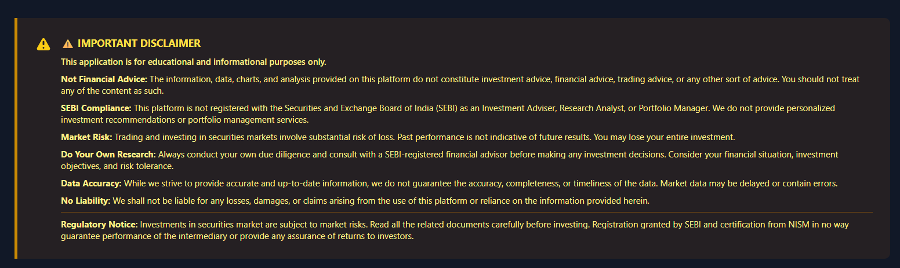
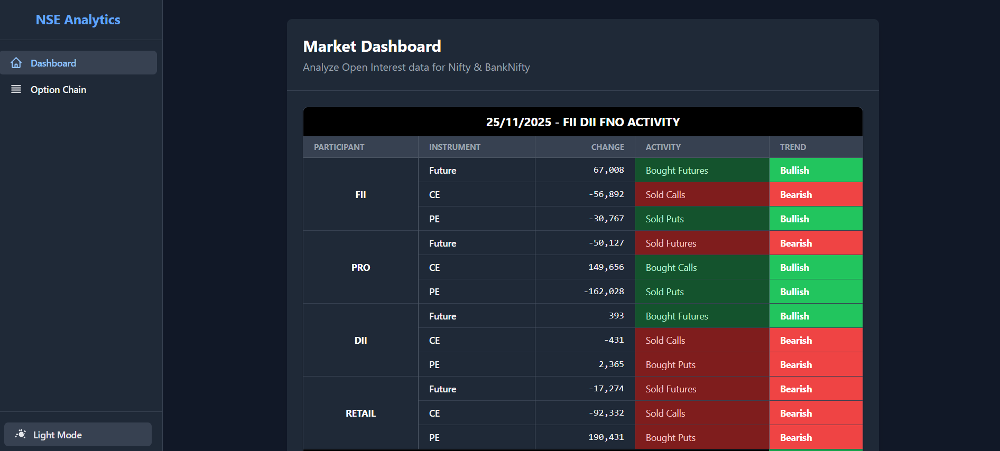
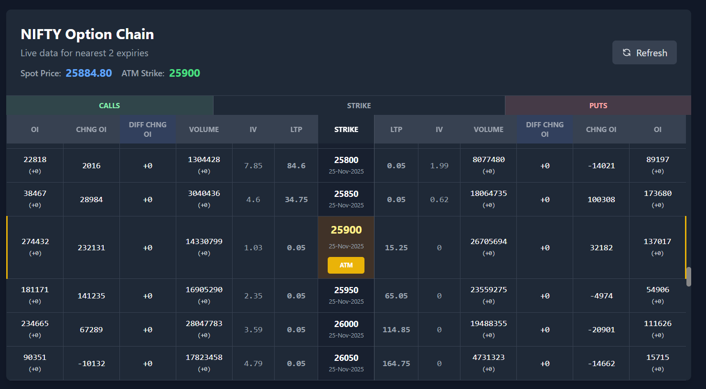
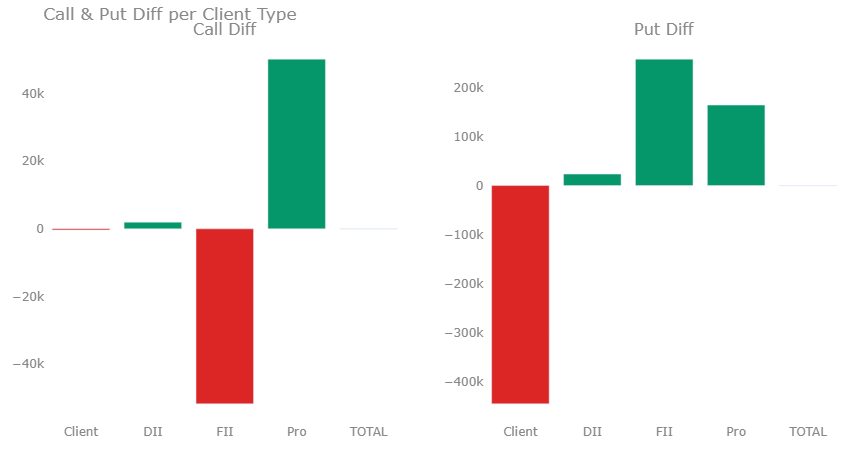
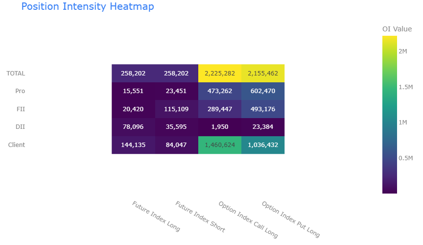
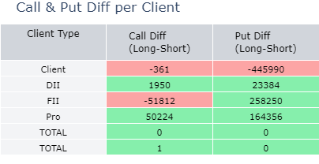
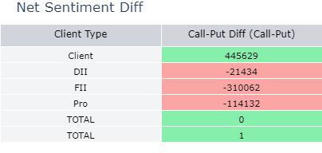

<div align="center">


<!--  -->

# 📈 NSE F&O Analytics Dashboard

[](https://www.python.org/)
[](https://flask.palletsprojects.com/)
[](https://tailwindcss.com/)
[](https://adxnse.vercel.app/)
[](LICENSE)

<p align="center">
  <b>Real-time Futures & Options Analysis | Institutional Sentiment Tracking | Live Option Chain</b>
</p>

[Live Demo 🚀](https://adxnse.vercel.app/) • [Report Bug 🐛](https://github.com/AdxStackDev/py_pd_csv1/issues)

</div>

---

## 📊 Project Overview

**NSE F&O Analytics Dashboard** is a high-performance web application designed for traders and analysts. It provides a real-time window into the National Stock Exchange of India's derivative market, offering institutional grade insights through a clean, modern interface.

<table>
<tr>
<td width="60%">

### 🎯 Key Features

- **FII/DII Activity Tracker**: Real-time tracking of institutional flows.
- **Sentiment Analysis**: Automated Bullish/Bearish/Neutral classification.
- **Live Option Chain**: Real-time OI tracking with ATM identification.
- **Heatmaps**: Visual position intensity indicators.
- **Smart Caching**: In-memory data management for speed.

</td>
<td width="40%">
<div align="center">
  
</div>
</td>
</tr>
</table>

---

## 📸 Application Gallery

<div align="center">

### 🖥️ Main Dashboard


### 🔗 Option Chain Analysis


### 📊 Call vs Put Difference


### 🌡️ OI Position Heatmap


### 👥 Client Participation


### 📉 Net Sentiment

</div>

---

## 🛠️ Technology Stack

<div align="center">

| Backend | Frontend | Deployment | Data |
|:---:|:---:|:---:|:---:|
|  |  |  |  |
|  |  |  |  |
|  |  | |  |

</div>

---

## 💡 Programming Concepts

<details>
<summary><b>1. Data Acquisition & Caching</b></summary>
<br>

**Challenge**: Efficiently fetch and store CSV data without file system access in serverless environment.

**Solution**: Implemented in-memory caching using Python dictionaries.

```python
_csv_cache = {}  # Global in-memory cache

def download_csv(date):
    if date_str in _csv_cache:
        return _csv_cache[date_str]
    # ... download logic
```
</details>

<details>
<summary><b>2. Holiday & Weekend Detection</b></summary>
<br>

**Logic**: Automatically skip non-trading days to find the most recent available data.

```python
def adjust_for_holidays(date):
    while date.weekday() > 4 or date in NSE_HOLIDAYS:
        date -= datetime.timedelta(days=1)
    return date
```
</details>

<details>
<summary><b>3. Sentiment Analysis Algorithm</b></summary>
<br>

**Logic**: Calculate market sentiment based on participant activity changes using a weighted scoring system for Futures and Options.
</details>

<details>
<summary><b>4. Serverless Architecture</b></summary>
<br>

Adapted for Vercel's read-only filesystem using stateless request handling and direct HTML rendering.
</details>

---

## 🚀 Getting Started

### Prerequisites

- Python 3.12+
- Git

### Installation

```bash
# Clone repository
git clone https://github.com/AdxStackDev/py_pd_csv1.git
cd py_pd_csv1

# Install dependencies
pip install -r requirements.txt

# Run application
python app.py
```

Access the dashboard at `http://localhost:5001`

---

<div align="center">

**Created with ❤️ by [Aditya (AdxStackDev)](https://github.com/AdxStackDev)**

</div>

---

<div align="center">
  <sub>⚠️ <b>Disclaimer</b>: This application is for educational purposes only. Not financial advice.</sub>
</div>
